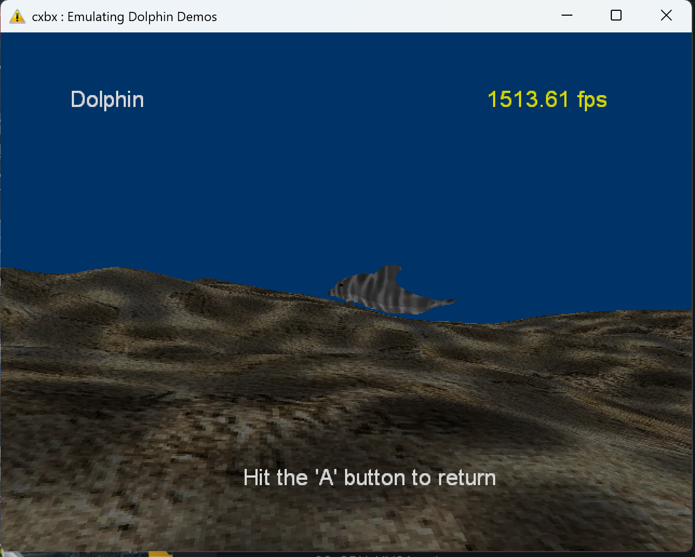
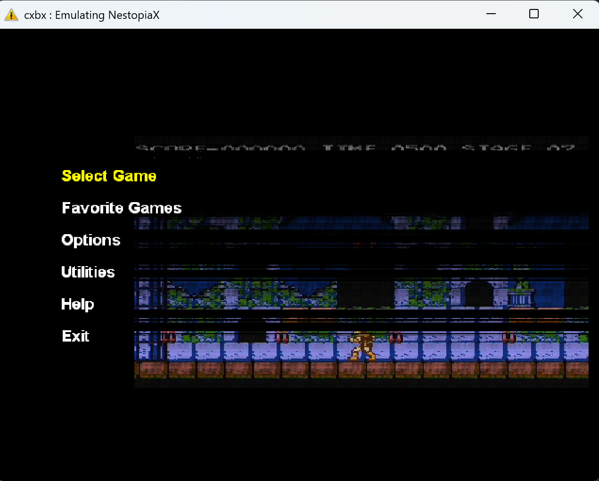

<p align="center">
  
</p>

# CXBX

[](LICENSE)
[](https://mesonbuild.com/)
[](meson.build)
[](meson.build)
[](cross/i686-windows-clang.ini)

CXBX is a classic original Xbox emulator. This tree contains the emulator,
the Win32 launcher/runtime code, bundled open-xdk support libraries, and a
modern Meson-based build/porting workspace.

This is the classic caustik CXBX codebase, not Cxbx-Reloaded. It is currently
being brought forward as a 32-bit Windows/x86 HLE emulator with reproducible
build files, structured debug traces, and an emulator conformance suite.





Current active developer and maintainer: Aleksandr Pavlov <ckidoz@gmail.com>.

## Current Status

This repository is for development and emulator bring-up. It is not a polished
end-user release.

- Build system: Meson-only.
- Primary target: 32-bit Windows (`i686-pc-windows-msvc`) with clang/lld tooling.
- Emulation model: HLE loader/API bridge; guest x86 code runs directly on the host CPU.
- Graphics: Direct3D HLE plus a partial register-level NV2A model for MMIO/RAMIN/PFIFO/PGRAPH-method paths. This is not full NV2A rasterization.
- Debugging: structured `Emu`, `KTRACE|`, `NV2A|`, and conformance trace paths.
- Conformance: the in-tree probe suite currently tracks CPU, memory, file I/O, kernel, graphics, and NV2A behavior.

Known active work includes source portability, x86 inline assembly/toolchain
compatibility, kernel export coverage, contiguous-memory behavior, and graphics
bring-up.

## How CXBX Works

CXBX is an HLE emulator:

1. It loads an Xbox executable (`.xbe`).
2. It maps the guest image and prepares a kernel thunk table.
3. It identifies XDK library functions with OOVPA signatures.
4. It patches located guest functions to jump to host implementations.
5. Guest x86 code runs natively on the host CPU.

This makes most failures API-boundary failures rather than CPU interpreter
failures. Typical debugging targets are missing XDK signatures, wrong HLE
implementations, unimplemented kernel ordinals, FS-segment state, and GPU MMIO
state.

## Getting Started

### Prerequisites

- **clang/LLVM** (clang, lld, llvm-lib, llvm-dlltool) — the primary toolchain.
  On Windows, install via `scoop install llvm` or download from llvm.org.
- **Meson ≥ 0.56** and **Ninja** — `pip install meson ninja` or
  `scoop install meson ninja`.
- **Python 3.13+** with **uv** for the conformance-suite and OOVPA tooling:
  `pip install uv`.
- **just** (command runner) — optional but recommended:
  `scoop install just`.
- **The Xbox XDK** (only needed for building conformance probes against the
  original SDK libraries). Use a legally obtained SDK installation configured
  locally.

### One-time setup

The emulator is 32-bit x86 and must be configured with the provided cross
file. `build-min` is the canonical build directory used by the `justfile`,
the conformance runner, and the docs:

```powershell
just init          # uv sync --dev  (Python tooling)
meson setup build-min --cross-file cross/i686-windows-clang.ini
```

### Build

```powershell
just build                  # meson compile -C build-min
```

Build options (set with `-D<option>=<value>` at setup time or via
`meson configure`):

- `build_xiso` (default `true`) — the `xiso` disc-image host tool. It has no
  emulator dependencies, so it can also be built in a plain native directory:
  `meson setup build-xiso` (no cross file) then `meson compile -C build-xiso`.
- `build_xusb` (default `false`) — the legacy open-xdk xusb OHCI stack.

### Run an Xbox title

```powershell
meson devenv -C build-min cxbx --run "path/to/default.xbe" --log "session-output.txt"
```

Use an absolute `--log` path — the runtime child process resolves it relative
to `%TEMP%`.

## Development Workflow

```powershell
just --list   # all recipes
just format   # clang-format (src/ include/ tests/) + ruff format (tools/xtest)
just lint     # clang-tidy (src/ tests/) + ruff check + mypy (tools/xtest)
just build    # meson compile -C build-min
```

Format and lint already scope `src/*`, so the `xiso` tool and any new code
under `src/` are covered automatically. Python tooling is managed with `uv`
(`uv sync --dev`, run once by `just init`).

## Conformance Suite

The suite under `tests/suite/` builds small self-checking Xbox executables and
runs them against an emulator. Each probe emits deterministic trace output and
PASS/FAIL checks.

```powershell
uv run python tools/xtest/xtest.py list
uv run python tools/xtest/xtest.py run --emulator cxbx
uv run python tools/xtest/xtest.py run --emulator cxbx --probe cpu_flags
uv run python tools/xtest/xtest.py run --emulator cxbx --probe cpu_flags --update-golden
```

The suite is emulator-agnostic; custom targets can be launched with:

```powershell
uv run python tools/xtest/xtest.py run --emulator custom --cmd "myemu --run {xbe} --dvd {rundir}"
```

Use the tracked `tools/config.toml.example` as the reference for local runner
settings such as the toolchain and emulator paths. Goldens live in
`tests/suite/golden/cxbx/`.

Current probe areas include:

- CPU flags and native x86 behavior
- memory allocation and read/write checks
- FATX-style file I/O through `D:`
- kernel HLE coverage and unimplemented-export trapping
- framebuffer availability checks
- NV2A PMC, interrupt, RAMIN, PFIFO, and PGRAPH method paths

## Debugging

Prefer file-based logging for reproducible runs:

```powershell
$env:CXBX_LOG_FILE = "session-output.txt"
```

Important trace channels:

- `Emu (0x<tid>): ...` for general emulator/runtime logs.
- `EmuFS (0x<tid>): ...` for FS-segment swaps.
- `KTRACE| ...` for kernel-thunk diagnostics.
- `NV2A| ...` for GPU MMIO/PFIFO/PGRAPH/RAMIN traces.
- `XT| ...` for structured conformance-probe output.

The debug workflow is built around identifying whether a failure is an OOVPA
signature miss, a wrong wrapper patch, an unimplemented kernel export, an FS
swap imbalance, or an NV2A register/model divergence.

For the full debug trace (HLE patch addresses, every located function), build
a `_DEBUG_TRACE` variant:

```powershell
meson setup build-review --cross-file cross/i686-windows-clang.ini
meson configure build-review "-Dcpp_args=['-D_DEBUG_TRACE']" "-Dc_args=['-D_DEBUG_TRACE']"
meson compile -C build-review
meson devenv -C build-review cxbx --run "path/to/default.xbe" --log "session-output.txt"
```

The log then contains lines like:

```
Emu (0x7C48): 0x00194960 -> EmuIDirect3DDevice8_SetRenderTarget
```

## Authoring OOVPA HLE Signatures

When an Xbox title calls an XDK function that cxbx doesn't yet patch, you add
an OOVPA (Ordered Offset Value Pair Array) signature that locates the function
in the guest image, and route it to a host `Emu*` wrapper. The workflow:

1. **Find the function in the relevant XDK library** and generate + verify a
   signature:

   ```powershell
   python tools/oovpa/gen_oovpa.py \
     --lib "path/to/sdk-library" \
     --func "_D3DDevice_SetRenderTarget@8=IDirect3DDevice8_SetRenderTarget_1_0_4627" \
     --verify-one "path/to/default.xbe" \
     --verify "path/to/xbe-corpus/*/default.xbe" \
     --pairs 8
   ```

   The signature must match **exactly once** in images that contain the
   function and **never more than once** anywhere. The tool reports `OK` /
   `FAIL` per image.

2. **Add the OOVPA definition + registration entry** to the appropriate
   version-specific `.inl` file (e.g. `src/cxbx/src/win32/CxbxKrnl/D3D8.1.0.4627.inl`),
   routed to an existing or new `Emu*` wrapper in `EmuD3D8.cpp` /
   `include/.../EmuD3D8.h`.

3. **Verify the patch address** — build a `_DEBUG_TRACE` variant and confirm
   the patch lands at the address reported by an independent symbol or
   disassembly tool. If both tools agree on the address, the signature is
   correct.

4. **Add or update a conformance probe** so the behavior is regression-locked
   (see `tests/suite/probes/d3d_state/` for the pattern).

## The `xiso` Tool (Xbox disc images)

`xiso` is a first-party C++17 host tool for listing, extracting, creating,
inspecting, and verifying Xbox GDF/XDFS disc images. It builds by default in
any build directory (see [Build](#build)):

```powershell
meson devenv -C build-min xiso -l "game.iso"                 # list
meson devenv -C build-min xiso -x -d destination "game.iso"  # extract
meson devenv -C build-min xiso -c source_dir output.iso      # create
meson devenv -C build-min xiso -i "game.iso"                 # header info
meson devenv -C build-min xiso -V "game.iso"                 # verify
```

## Repository Layout

```text
3rdparty/dxsdk/              Bundled DirectX SDK headers
docs/                        Project documentation, reference notes, screenshots, branding
Lib/                         Bundled import libraries
PostBuild/                   Legacy post-build utilities
Resource/                    Win32 resources, icons, bitmaps, menus, dialogs
cross/                       Meson cross files
include/cxbx/include/        CXBX public/internal headers
include/open-xdk/include/    Bundled open-xdk headers
src/cxbx/                    Emulator launcher, core, and HLE runtime
src/open-xdk/src/            Bundled open-xdk support libraries
src/xiso/                    xiso disc-image host tool
tests/                       Test assets and XBE probes
tools/oovpa/                 OOVPA signature generator
tools/xtest/                 Conformance-suite runner
```

## Documentation

Useful starting points:

- [docs/README.md](docs/README.md) - documentation index.
- [docs/todo.md](docs/todo.md) - task list and open engineering topics.
- [docs/changelog.md](docs/changelog.md) - historical project changes.
- [docs/direct3d.md](docs/direct3d.md) - Direct3D notes.
- [docs/input.md](docs/input.md) - input notes.
- [tests/suite/README.md](tests/suite/README.md) - conformance suite guide.
- [tools/xtest/README.md](tools/xtest/README.md) - probe runner usage.

## Contributing

Good contributions are narrow, testable, and preserve the current Meson build.
For emulator behavior changes, prefer adding or updating a conformance probe so
the expected behavior is captured in a repeatable way.

Before submitting changes:

```powershell
just format
just lint
meson compile -C build-min
```

If a build or test cannot be run on your host, call that out with the reason and
the target/toolchain you used.

## Legal

CXBX is licensed under the GNU General Public License version 2 or later. See
[LICENSE](LICENSE).

This project does not include Xbox BIOS images, retail game data, or console
firmware. It does include legacy compatibility material such as DirectX headers
and import libraries; review the tree before redistributing binaries or bundles.
Use only software and game dumps that you are legally allowed to use. CXBX is
not affiliated with Microsoft.
